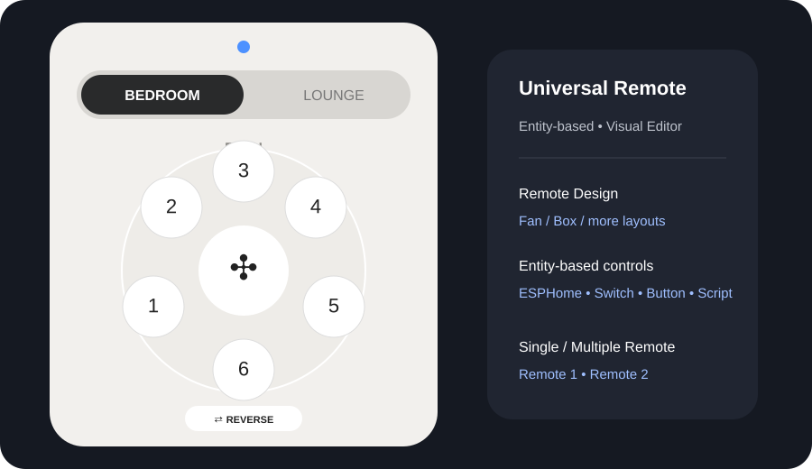

# Universal Remote Card

A modern, customizable **universal remote card for Home Assistant**.

> **Entity-based by design:** every remote control can be connected to a Home Assistant entity or action. The card is **not limited to specific entity domains** such as `fan.*` or `light.*`, making it suitable for ESPHome devices, switches, buttons, scripts, helpers, and custom Home Assistant setups.



The project is designed to support multiple remote/device layouts from one card. The current design is a fan remote, with additional remote designs being added over time.

## Current status

🚧 **Early development / prototype**

The current **Basic Celling Fan** remote design is finalized as the stable visual baseline for the project. Future remote designs will be added alongside it without replacing the existing fan layout.

The card currently includes a polished fan-remote layout, Home Assistant Visual Editor support, configurable entities/actions, optional multiple-remote support, and Auto/Light/Dark theme selection.

## Current features

### Fan remote design

- Modern circular fan control
- Fan speed 1–6
- Fan power button with fan icon
- Reverse
- ECO
- Light
- MAX
- 1H / 4H / 8H timers
- Press feedback / indicator blink
- Responsive mobile and desktop layout
- No unnecessary status/ready section in the remote UI

### Entity-based controls

The card uses an **entity-based control model**. Each button/control can be mapped to a Home Assistant entity or supported action instead of being tied to one specific device type.

This means the same remote design can work with different hardware and integrations. For example, a fan button can be connected to a native Home Assistant fan, an ESPHome switch/button, a script, or another entity used by the user's setup.

### Themes

The Visual Editor provides a **Theme** selector:

- **Auto** — follows the Home Assistant dark/light mode
- **Light** — forces the light design
- **Dark** — forces the dark design

Auto is the default.

### Remote designs

The Visual Editor includes a **Remote Design** selector.

Currently available:

- **Fan** — current Basic Celling Fan remote design
- **Box** — reserved for the Fenda sound-box remote design

More layouts can be added without replacing the existing designs.

### Single / Multiple Remote

**Multiple Remote OFF**

The card works as a single remote and does not show remote tabs.

**Multiple Remote ON**

The card can show two independent remotes, each with its own:

- Remote name
- Remote design
- Device/fan name
- Fan entity
- Light entity
- Speed 1–6 entities/actions
- Reverse
- ECO
- MAX
- Timer 1H / 4H / 8H

This allows combinations such as:

- Remote 1 → Fan
- Remote 2 → Box

### Visual Editor

The card is configurable from Home Assistant's Visual Editor.

Entity selectors intentionally allow **all Home Assistant entities**, rather than restricting Fan/Light fields to only `fan.*` or `light.*`. This makes the card suitable for ESPHome devices, switches, buttons, scripts, helpers, and other custom setups.

The editor uses clear labels such as:

- Remote 1 Fan
- Remote 1 Light
- Remote 1 Speed 1
- Remote 1 Speed 2
- Remote 2 Fan
- Remote 2 Light
- Remote 2 Speed 1

instead of short internal names such as `r1_fan` or `r2_light`.

## Default device names

The current design uses these default names:

- Fan → **Basic Celling Fan**
- Box → **Fenda Sound Box**

Both names can be customized from the Visual Editor.

## Installation

### Method 1 — HACS (Recommended)

This repository is installed through HACS as a **Dashboard** custom repository. HACS previously called this type **Lovelace** or **Plugin**.

1. Open **HACS** in Home Assistant.
2. Open the **⋮** menu in the top-right corner.
3. Select **Custom repositories**.
4. Add:

   `https://github.com/scmsohel/universal-remote-card`

5. Select repository type **Dashboard** (called **Lovelace** in some HACS versions).
6. Click **Add**.
7. Find **Universal Remote Card** in HACS and click **Download**.
8. HACS registers the dashboard resource automatically.
9. Hard-refresh the browser if the card does not appear immediately.
10. Add the card to a dashboard.

> No manual `/config/www` copy or manual resource entry is required when installing through HACS.

### Method 2 — Manual

1. Copy `universal-remote-card.js` to:

   `/config/www/universal-remote-card.js`

2. Add a resource in **Settings → Dashboards → Resources**:

```yaml
url: /local/universal-remote-card.js
type: module
```

3. Add the card to a dashboard using `custom:universal-remote-card`.

## Configuration

The preferred method is the **Visual Editor**.

A minimal YAML configuration can be as simple as:

```yaml
type: custom:universal-remote-card
multiple_remotes: false
rooms:
  remote1:
    design: fan
    fan_name: Basic Celling Fan
    fan: fan.bedroom_fan
    light: light.bedroom_light
    actions:
      speed_1: script.fan_speed_1
      speed_2: script.fan_speed_2
      speed_3: script.fan_speed_3
      speed_4: script.fan_speed_4
      speed_5: script.fan_speed_5
      speed_6: script.fan_speed_6
      reverse: script.fan_reverse
      eco: script.fan_eco
      max: script.fan_max
      timer_1h: script.fan_timer_1h
      timer_4h: script.fan_timer_4h
      timer_8h: script.fan_timer_8h
```

### Multiple remote example

```yaml
type: custom:universal-remote-card
multiple_remotes: true
rooms:
  remote1:
    name: BEDROOM
    design: fan
    fan_name: Basic Celling Fan
    fan: fan.bedroom_fan
    light: light.bedroom_light
    actions:
      speed_1: script.fan_speed_1
      speed_2: script.fan_speed_2
      speed_3: script.fan_speed_3
      speed_4: script.fan_speed_4
      speed_5: script.fan_speed_5
      speed_6: script.fan_speed_6
      reverse: script.fan_reverse
      eco: script.fan_eco
      max: script.fan_max
      timer_1h: script.fan_timer_1h
      timer_4h: script.fan_timer_4h
      timer_8h: script.fan_timer_8h

  remote2:
    name: LOUNGE
    design: box
    fan_name: Fenda Sound Box
```

## Roadmap

- Complete the Fenda sound-box remote design
- Add the Walton Ceiling Fan remote design as a separate layout
- Add more remote/device layouts (AC, TV, light, curtain, media, etc.)
- Expand Visual Editor controls
- Support richer tap / double-tap / hold actions
- Improve state-aware buttons and animations
- Add configurable dimensions, icons, and layouts
- Add richer Home Assistant service/action configuration
- Add proper HACS releases and versioning
- Connect the card to RF/IR/ESPHome-based remotes

## License

This project is licensed under the **MIT License**. See [LICENSE](LICENSE) for details.
